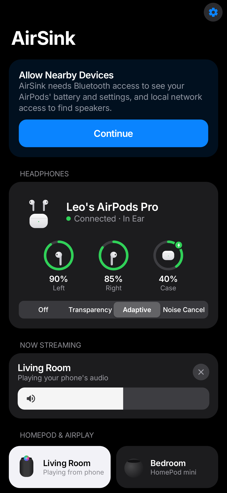
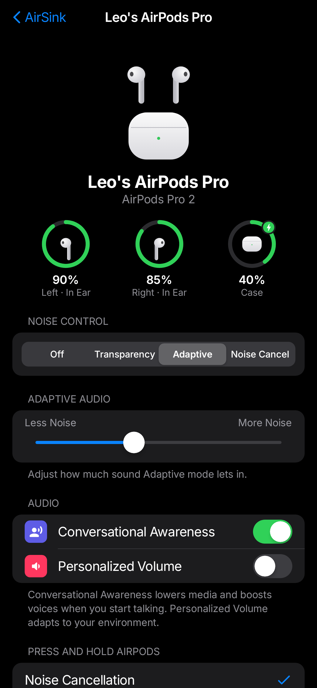
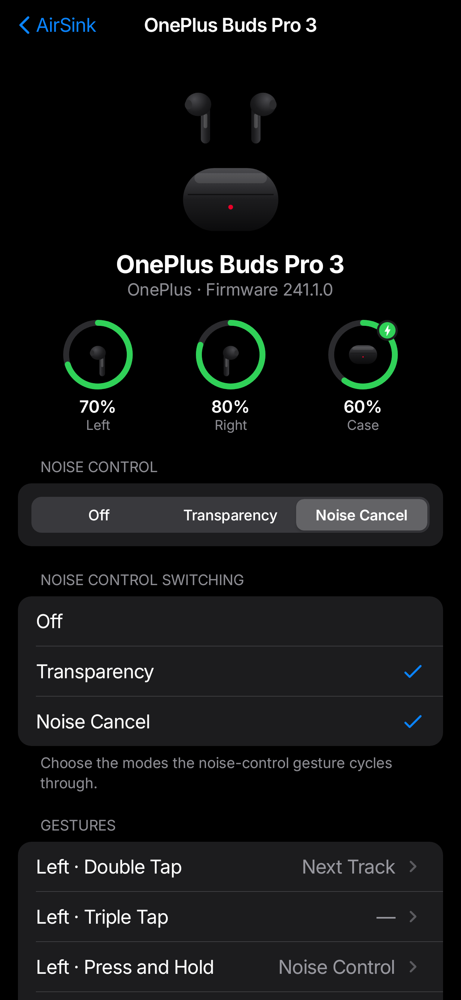
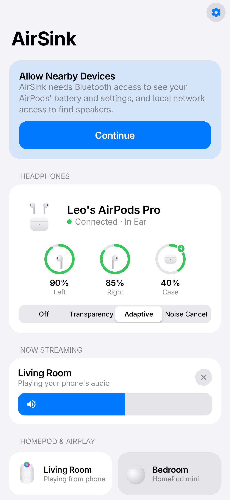
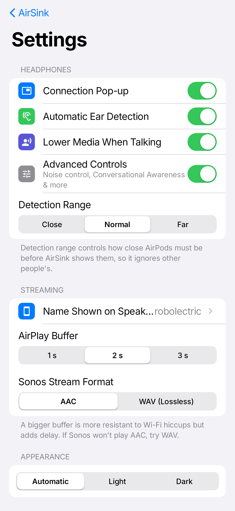

# AirSink

Seamlessly connect your Android phone (built for the Galaxy S24 FE) to Apple, OnePlus and Sonos audio gear, with an iOS-style interface.

| Home | AirPods | OnePlus Buds | Light mode | Settings |
|---|---|---|---|---|
|  |  |  |  |  |

*(Rendered with sample devices.)*

## Features

### AirPods and Beats
- **Battery for each AirPod and the case**, including charging state. This comes from the Bluetooth LE broadcasts AirPods send, so it works without pairing tricks or root.
- **iOS-style pop-up** when you open the case near your phone, over any app.
- **Automatic ear detection**: pulls an AirPod out and media pauses; put it back and it resumes.
- **Noise control**: Off, Transparency, Adaptive and Noise Cancellation, plus the Adaptive strength slider.
- **Conversational Awareness, Personalized Volume**, press-and-hold mode cycle, one-AirPod ANC, volume swipe, rename.
- **Lower media when talking**: AirSink ducks your phone's volume when AirPods report that you're speaking, like an iPhone does.
- Battery notification and a guided **"Pair New"** flow using Android's companion-device pairing.

### OnePlus Buds (plus OPPO Enco and realme Buds)
- Battery for each earbud and the case, including charging, on the Home screen and in the notification.
- **Noise control**: Off, Transparency, Noise Cancellation, OnePlus strength levels (Smart, Mild, Moderate, Max, Adaptive), and which modes the gesture cycles through.
- **In-ear status** and the earbuds' own automatic ear detection toggle.
- **Custom gestures**: double tap, triple tap and press-and-hold on each side, mapped to play/pause, tracks, volume, voice assistant, noise control or game mode.
- **LDAC**, **Game Mode** (low latency) and **Dual Connection** toggles.
- **Find My Earbuds**: makes both earbuds play a loud sound.
- Firmware version.

These buds are OPPO-made and share one control protocol, but OnePlus firmware encodes noise control differently, so AirSink picks the right variant from the earbuds' name. Settings a particular model doesn't report stay greyed out.

### HomePod and AirPlay
- Finds HomePod, HomePod mini, Apple TV and other AirPlay 2 receivers on your Wi-Fi.
- Tap a speaker to **play whatever your phone is playing** on it. Tap several for multi-room.
- Per-speaker volume, AirPlay buffer setting, and a Quick Settings tile.

### Sonos
- Finds every room and group.
- Streams your phone's audio (as AAC, or lossless WAV).
- Now Playing with play/pause/skip, group and per-room volume.
- **Grouping**: pick which rooms play together.
- Bass, treble and loudness; **Night Sound** and **Speech Enhancement** on soundbars.
- Status light and touch-control lock.
- Uses AirPlay automatically for Sonos speakers that support it.

## Install

Every push builds an APK in GitHub Actions. Open the latest **Build APK** run, download the `AirSink-apk` artifact, and install `app-release.apk` on the phone (allow "Install unknown apps" for your browser/files app).

Or build it yourself: `./gradlew assembleRelease`.

On first launch, allow **Nearby devices** and **Notifications**. For the case-open pop-up, also allow **Display over other apps** (Settings → Permissions in the app). When you first stream, Android asks to share your screen: choose **Entire screen**. That's how Android lets an app capture audio; nothing is recorded or leaves your network.

## Known limits

These come from Android and Apple, not bugs to be fixed in the app:

- **Advanced AirPods controls** (noise control, Conversational Awareness, rename…) use Apple's private accessory protocol over a Bluetooth channel that some Android builds block. If the AirPods page says *Unavailable*, those controls need root (see [LibrePods](https://github.com/kavishdevar/librepods)). Battery, ear detection and the pop-up still work.
- **Connecting** already-paired AirPods: Android doesn't let normal apps start a Bluetooth audio connection, so the Connect button opens the Bluetooth panel when needed.
- **HomePod** has to allow access from **Everyone** or **Anyone on the same network** without a password (Home app → Home Settings → Speakers & TV). HomePod settings like Siri or Intercom aren't reachable from Android.
- **OnePlus controls** need the earbuds' control channel to be free. If HeyMelody or the OnePlus app is holding it, close that app and tap *Retry*.
- **Apps that block capture** (some DRM'd video and music apps) will be silent when streaming.
- AirPlay has around 2 s of delay (adjustable), so it's great for music and less so for video.

## How it works

| Area | Code | Protocol |
|---|---|---|
| AirPods status | `airpods/ProximityParser.kt` | Apple Continuity "proximity pairing" BLE advertisements |
| AirPods controls | `airpods/AapClient.kt` | Apple Accessory Protocol over L2CAP PSM 0x1001 |
| OnePlus / OPPO / realme | `melody/` | OPPO "Melody" protocol over RFCOMM |
| AirPlay | `airplay/AirPlaySink.kt` | AirPlay 2: transient HomeKit pairing (SRP-6a/3072, PIN 3939), ChaCha20-Poly1305 RTSP, realtime ALAC over RTP with NTP timing |
| Sonos | `sonos/` | SSDP discovery, UPnP/SOAP control, HTTP live stream |
| Capture | `cast/CastService.kt` | Android AudioPlaybackCapture |

The AirPlay crypto is checked against reference implementations in `ReferenceVectorsTest` (SRP vs. `srptools` as used by pyatv, HKDF/ChaCha20 vs. `cryptography`, bplist vs. `plistlib`). `scripts/verify_alac.py` decodes our ALAC frames with FFmpeg and confirms a bit-exact round trip.

Credits: the AirPods protocol work of [LibrePods](https://github.com/kavishdevar/librepods) and [OpenPods](https://github.com/adolfintel/OpenPods); [Gadgetbridge](https://codeberg.org/Freeyourgadget/Gadgetbridge) and [QuickBuds](https://github.com/spizganed/QuickBuds) for the OPPO/realme and OnePlus earbud protocols; and [OwnTone](https://github.com/owntone/owntone-server) / [pyatv](https://github.com/postlund/pyatv) for AirPlay 2. UI font: [Inter](https://rsms.me/inter/) (SIL OFL).

Not affiliated with Apple, OnePlus, OPPO, realme or Sonos.
